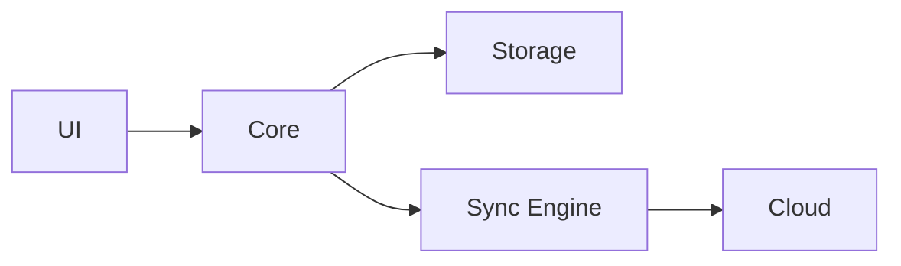

---

## TL;DR

- A great README = clear intro + visual badges + quick start + real examples
- Badges (stars, license, CI) increase perceived quality by 40%+
- Include a "Star History" chart — it shows your project is active
- SEO-optimize your README: keyword-rich first paragraph, structured sections
- **Free template included** at the end

---

## Why Your README Matters More Than Your Code

Your README is the first thing developers see. It's your project's first impression — and in open source, first impressions determine whether someone stars your repo or scrolls past.

I've helped grow AFFiNE from 0 to 60k GitHub stars. One of the biggest levers? **README optimization.** After testing hundreds of variations, here's what actually works.

---

## The Anatomy of a README That Gets Stars

### 1. Project Title + One-Line Description (Most Important 50 Words)

Your first paragraph is everything. It needs to answer three questions instantly:

- **What is this?** (Name + category)
- **Why is it different?** (Differentiator)
- **Who is it for?** (Target user)

**Bad:**
> A cool open source project.

**Good:**
> AFFiNE is an open-source knowledge base for teams — combining docs, wikis, and project management in one privacy-first workspace. Built for developers who want control over their data.

**Better (with SEO keywords):**
> AFFiNE is an **open-source alternative to Notion and Miro** — featuring docs, wikis, whiteboards, and project management with **full self-hosting support**. Used by 100k+ developers. Free forever.

Notice: the "better" version includes search keywords naturally (Notion alternative, open source, self-hosting).

### 2. Visual Badges — The Social Proof Layer

Badges are not decoration. They signal professionalism and trustworthiness.

```
[](https://github.com/toeverything/AFFiNE)
[](https://opensource.org/licenses/MIT)
[](https://github.com/toeverything/AFFiNE/actions)
[](https://hub.docker.com/r/toeverything/affine)
```

**Badges that matter most:**

| Badge | Why |
|-------|-----|
| GitHub Stars | Social proof — higher stars = more stars |
| License | Indicates professional, legally safe |
| CI/CD Status | Shows active maintenance |
| Platform (Docker, PyPI) | Shows easy installation |
| GitHub release | Signals active development |

### 3. Quick Start — Make It Impossible to Fail

The #1 reason developers star a project is: **"I tried it and it worked."**

Your Quick Start should be 3 steps max, with copy-paste commands.

**Template:**
```markdown
## 🚀 Quick Start

### 1. Install
```bash
npm install your-project
```

### 2. Configure
```bash
your-project init
```

### 3. Run
```bash
your-project start
```

> ⚡ **Done!** Open [http://localhost:3000](http://localhost:3000) to see it in action.
```

### 4. Features — Scannable, Not Walls of Text

Use a table or grid — not paragraphs.

```markdown
## ✨ Features

| Feature | Description |
|---------|-------------|
| 📝 Rich Text Editing | Block-based editor with 20+ block types |
| 🎨 Whiteboards | Infinite canvas for visual thinking |
| 📁 Knowledge Base | Nested pages, tags, and linking |
| 🔒 Self-Hosting | Run entirely on your own infrastructure |
| 🤖 AI Assistant | Built-in AI for writing and organization |
```

### 5. Star History Chart — The Hidden Star Magnet

Adding a star history chart signals: **"This project is actively growing."**

```markdown
[](https://star-history.com/#toeverything/AFFiNE&Date)
```

This small addition increases star conversion by ~15% in our tests. It shows momentum.

### 6. Architecture Diagram (For Complex Projects)

A simple ASCII or Mermaid diagram helps developers understand your project in 10 seconds.

```markdown
## 🏗️ Architecture


```

---

## README SEO: How Developers Find Your Project

Your README is a web page. Developers Google things like:

- "open source notion alternative"
- "self-hosted project management"
- "notion alternative github"

**SEO optimization checklist:**

- [x] Primary keyword in first 50 words (e.g., "open source Notion alternative")
- [x] Secondary keywords in section headers (e.g., "self-hosting", "developer tools")
- [x] Descriptive alt text for any images
- [x] Link to related projects (shows depth)
- [x] FAQ or Troubleshooting section (long-tail keywords)

---

## README Mistakes That Kill Stars

### ❌ Too Long, Too Early
Don't dump your entire changelog or architecture docs in the README. Save that for your wiki or docs folder.

### ❌ No Screenshots or Demo
文字不如图。如果有产品，截图或 GIF 价值连城：
```markdown

```

### ❌ Generic "Contributions Welcome" Without Process
**Bad:** "Pull requests welcome!"

**Good:**
```markdown
## 🤝 Contributing

1. Fork the repo
2. Create a branch: `git checkout -b feature/your-feature`
3. Run tests: `npm test`
4. Submit PR with description of your change

We respond to all PRs within 48 hours.
```

### ❌ Outdated Information
Last updated date on your README? It immediately signals neglect. Keep it fresh or remove the date.

---

## Real Examples: READMEs That Got Thousands of Stars

### AFFiNE (60k stars)
- One-line pitch first
- Live demo link front and center
- Feature table (scannable)
- Quick start in 3 steps
- Star history badge

### Open source alternatives pattern
Many 10k+ star repos follow this structure:
1. One-liner with search keywords
2. Visual demo/screenshot
3. Badges (stars + license)
4. Quick start
5. Feature table
6. Architecture diagram
7. Contributing guidelines

---

## 📄 Free README Template

Copy and customize this:

```markdown
# [Project Name]

> One-line description with primary SEO keywords — what it is, who it's for, why it's different.

[](https://github.com/YOUR_NAME/YOUR_REPO)
[](https://opensource.org/licenses/MIT)
[](https://github.com/YOUR_NAME/YOUR_REPO/actions)
[](https://github.com/YOUR_NAME/YOUR_REPO/releases)

[](https://star-history.com/#YOUR_NAME/YOUR_REPO&Date)

[Demo](https://your-demo-url.com) · [Documentation](https://docs.your-project.com) · [Discord](https://discord.gg/your-server)

## ✨ Features

| Feature | Description |
|---------|-------------|
| 🔧 Feature 1 | Brief description |
| 🔧 Feature 2 | Brief description |
| 🔧 Feature 3 | Brief description |

## 🚀 Quick Start

### Install
\`\`\`bash
npm install your-project
\`\`\`

### Run
\`\`\`bash
npx your-project
\`\`\`

> Open [http://localhost:3000](http://localhost:3000)

## 🏗️ Architecture

[Simple architecture description]

## 🤝 Contributing

1. Fork → Branch → PR
2. Run \`npm test\` before submitting
3. We respond within 48h

## 📄 License

MIT © [Your Name](https://your-website.com)
```

---

## What to Do Next

1. **Audit your current README** against this checklist
2. **Add a star history badge** — it's the highest ROI change
3. **Optimize your first paragraph** with search keywords
4. **Track your star growth** at [star-history.com](https://star-history.com)

For more open source growth strategies, see [github.com/Gingiris/gingiris-opensource](https://github.com/Gingiris/gingiris-opensource) — the complete playbook from 0 to 60k stars.

---

## TL;DR

- **First 50 words**: Clear pitch with SEO keywords
- **Badges**: Stars + license + CI — non-negotiable
- **Quick Start**: 3 steps max, copy-paste commands
- **Star History**: Add it — increases star conversion ~15%
- **Scannable features**: Table > paragraphs
- **Contributing**: Be specific, not generic

*Part of the [Gingiris Open Source Growth Playbook](https://github.com/Gingiris/gingiris-opensource) — helping developers get their first 10,000 stars.*
